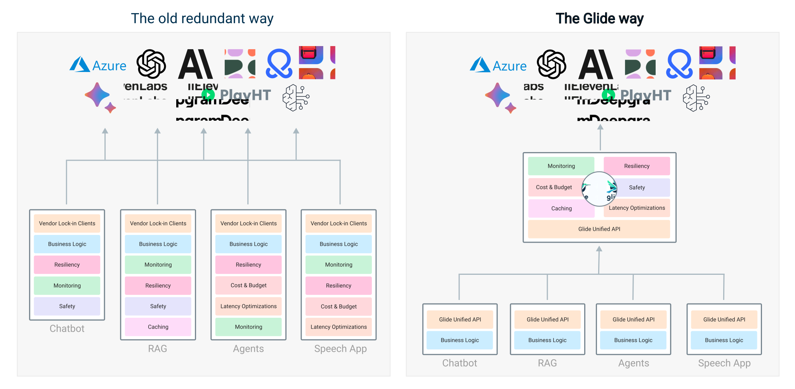

# Glide: Cloud-Native LLM Gateway for Seamless LLMOps
<div align="center">
    
</div>


[](https://codecov.io/github/EinStack/glide)
[](https://discord.gg/pt53Ej7rrc)
[](https://glide.einstack.ai/)
[](https://github.com/EinStack/glide/blob/main/LICENSE)
[](https://app.fossa.com/projects/git%2Bgithub.com%2FEinStack%2Fglide?ref=badge_shield)

---

Glide is your go-to cloud-native LLM gateway, delivering high-performance LLMOps in a lightweight, all-in-one package.

We take all problems of managing and communicating with external providers out of your applications,
so you can dive into tackling your core challenges.

Glide sits between your application and model providers to seamlessly handle various LLMOps tasks like
model failover, caching, key management, etc. 



Take a look at the develop branch.

Check out our [documentation](https://glide.einstack.ai)!

> [!Warning]
> Glide is under active development right now. Give us a star to support the project ✨

## Features

- **Unified REST API** across providers. Avoid vendor lock-in and changes in your applications when you swap model providers.
- **High availability** and **resiliency** when working with external model providers. Automatic **fallbacks** on provider failures, rate limits, transient errors. Smart retries to reduce communication latency.
- Support **popular LLM providers**.
- **High performance**. Performance is our priority. We want to keep Glide "invisible" for your latency-wise, while providing rich functionality.
- **Production-ready observability** via OpenTelemetry, emit metrics on models health, allows whitebox monitoring (coming soon)
- Straightforward and simple maintenance and configuration, centralized API key control & management & rotation, etc.

## Supported Providers

### Large Language Models

|                                                     | Provider      | Support Status  |
|-----------------------------------------------------|---------------|-----------------|
|      | OpenAI        | 👍  Supported  |
|       | Azure OpenAI  | 👍  Supported  |
|      | Cohere        | 👍  Supported |
|      | OctoML        | 👍  Supported  |
|   | Anthropic     | 👍  Supported  |
|        | Google Gemini | 🏗️ Coming Soon |


### Routers

Routers are a core functionality of Glide. Think of routers as a group of models with some predefined logic. For example, the resilience router allows a user to define a set of backup models should the initial model fail. Another example, would be to leverage the least-latency router to make latency sensitive LLM calls in the most efficient manner.

Detailed info on routers can be found [here](https://glide.einstack.ai/essentials/routers).

#### Available Routers

| Router      | Description  |
|---------------|-----------------|
| Priority        | When the target model fails the request is sent to the secondary model. The entire service instance keeps track of the number of failures for a specific model reducing latency upon model failure  |
| Least Latency        | This router selects the model with the lowest average latency over time. If the least latency model becomes unhealthy, it will pick the second the best, etc.  |
| Round Robin        | Split traffic equally among specified models. Great for A/B testing.  |
| Weighted Round Robin | Split traffic based on weights. For example, 70% of traffic to Model A and 30% of traffic to Model B.  |


## Get Started

### Installation

> [!Note]
> Windows users should follow an instruction right from [the demo README file](https://github.com/EinStack/glide-demo) that specifies how to do the steps without the `make` command as Windows doesn't come with it by default.

The easiest way to deploy Glide is to our [demo repository](https://github.com/EinStack/glide-demo.git) and [docker-compose](https://docs.docker.com/compose/).

### 1. Clone the demo repository

```bash
git clone https://github.com/EinStack/glide-demo.git
```

### 2. Init Configs

The demo repository comes with a basic config. Additionally, you need to init your secrets by running:

```bash
make init # from the demo root
```

This will create the `secrets` directory with one `.OPENAI_API_KEY` file that you need to put your key to.

### 3. Start Glide

After that, just use docker compose via this command to start your demo environment:

```bash
make up
```

### 4. Sample API Request to `/chat` endpoint

See [API Reference](https://glide.einstack.ai/api-reference/introduction) for more details.

```json
{
 "model": "gpt-3.5-turbo", # this is not required but can be used to specify different prompts to different models
 "message":
      {
        "role": "user",
        "content": "Where was it played?"
      },
  "messageHistory": [
      {"role": "system", "content": "You are a helpful assistant."},
      {"role": "user", "content": "Who won the world series in 2020?"},
      {"role": "assistant", "content": "The Los Angeles Dodgers won the World Series in 2020."}
    ]
}
```

### API Docs

Finally, Glide comes with OpenAPI documentation that is accessible via http://127.0.0.1:9099/v1/swagger/index.html

That's it 🙌

Use [our documentation](https://glide.einstack.ai) to further learn about Glide capabilities and configs.

---

Other ways to install Glide are available:

### Homebrew (MacOS)

```bash
brew tap einstack/tap
brew install einstack/tap/glide
```

### Snapcraft (Linux)

[](https://snapcraft.io/glide)

```bash
snap install glide
```

To upgrade the already installed package, you just need to run:

```bash
snap refresh glide
```

Detailed instruction on Snapcraft installation for different Linux distos:

- [Arch](https://snapcraft.io/install/glide/arch)
- [CentOS](https://snapcraft.io/install/glide/centos)
- [Debian](https://snapcraft.io/install/glide/debian)
- [elementaryOS](https://snapcraft.io/install/glide/elementary)
- [Fedora](https://snapcraft.io/install/glide/fedora)
- [KDE Neon](https://snapcraft.io/install/glide/kde-neon)
- [Kubuntu](https://snapcraft.io/install/glide/kubuntu)
- [Manjaro](https://snapcraft.io/install/glide/manjaro)
- [Pop! OS](https://snapcraft.io/install/glide/pop)
- [openSUSE](https://snapcraft.io/install/glide/opensuse)
- [RHEL](https://snapcraft.io/install/glide/rhel)
- [Ubuntu](https://snapcraft.io/install/glide/ubuntu)
- [Raspberry Pi](https://snapcraft.io/install/glide/raspbian)

### Docker Images

Glide provides official images in our [GHCR](https://github.com/EinStack/glide/pkgs/container/glide) & [DockerHub](https://hub.docker.com/u/einstack  ):

- Alpine 3.19:
```bash
docker pull ghcr.io/einstack/glide:latest-alpine 
```

- Ubuntu 22.04 LTS:
```bash
docker pull ghcr.io/einstack/glide:latest-ubuntu
```

- Google Distroless (non-root)
```bash
docker pull ghcr.io/einstack/glide:latest-distroless
```

- RedHat UBI 8.9 Micro
```bash
docker pull ghcr.io/einstack/glide:latest-redhat
```

### Helm Chart

Coming Soon

## Community

- Join [Discord](https://discord.gg/pt53Ej7rrc) for real-time discussion

Open [an issue](https://github.com/EinStack/glide/issues) or start [a discussion](https://github.com/EinStack/glide/discussions) 
if there is a feature or an enhancement you'd like to see in Glide.

## Contribute

- Maintainers
    
    - [Roman Hlushko](https://github.com/roma-glushko), Software Engineer, Distributed Systems & MLOps
    - [Max Krueger](https://github.com/mkrueger12), Data & ML Engineer

Thanks everyone for already put their effort to make Glide better and more feature-rich: 

<a href="https://github.com/EinStack/glide/graphs/contributors">
  
</a>

## License

Apache 2.0

[](https://app.fossa.com/projects/git%2Bgithub.com%2FEinStack%2Fglide?ref=badge_large)
