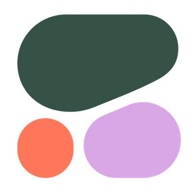

# Glide: Cloud-Native LLM Gateway for Seamless LLMLOps

    

Glide is your go-to cloud-native model gateway, delivering high-performance LLMLOps in a lightweight, all-in-one package.

We take all problems of managing and communicating with external providers out of your applications,
so you can dive into tackling your core challenges.

Glide sits between your application and model providers to seamlessly handle various LLMOps tasks like
model failover, caching, key management, etc. 

> [!Warning]
> Glide is under active development right now. Give us a star to support the project ✨

## Features

- **Unified REST API** across providers. Avoid vendor lock-in and changes in your applications when you swap model providers.
- **High availability** and **resiliency** when working with external model providers. Automatic **fallbacks** on provider failures, rate limits, transient errors. Smart retries to reduce communication latency.
- Support **popular LLM providers**.
- **High performance**. Performance is our priority. We want to keep Glide "invisible" for your latency-wise, while providing rich functionality.
- **Production-ready observability** via OpenTelemetry, emit metrics on models health, allows whitebox monitoring.
- Straightforward and simple maintenance and configuration, centrilized API key control & management & rotation, etc.

## Supported Providers

### Large Language Models

|                                                     | Provider      | Support Status  |
|-----------------------------------------------------|---------------|-----------------|
|      | OpenAI        | 👠 Supported  |
|       | Azure OpenAI  | 🏗️ Coming Soon  |
|      | Cohere        | 🏗️ Coming Soon  |
|      | OctoML        | 🏗️ Coming Soon  |
|   | Anthropic     | 🏗️ Coming Soon |
|        | Google Gemini | 🏗️ Coming Soon |

## Get Started

TBU

### API Docs

Glide comes with OpenAPI documentation that is accessible via http://127.0.0.1:9099/v1/swagger/index.html

## Community

- Join [Discord](https://discord.gg/z4DmAbJP) for real-time discussion

Open [an issue](https://github.com/modelgateway/glide/issues) or start [a discussion](https://github.com/modelgateway/glide/discussions) 
if there is a feature or an enhancement you'd like to see in Glide.

## Contribute

- Maintainers
    
    - [Roman Hlushko](https://github.com/roma-glushko), Software Engineer, Distributed Systems & MLOps
    - [Max Krueger](https://github.com/mkrueger12), Data & ML Engineer

Thanks everyone for already put their effort to make Glide better and more feature-rich: 

